# IRCTC Backend System - Architecture Diagrams

This document contains Mermaid diagrams illustrating the system architecture, database relationships, API flows, and key processes.

---

## 1. System Architecture Overview

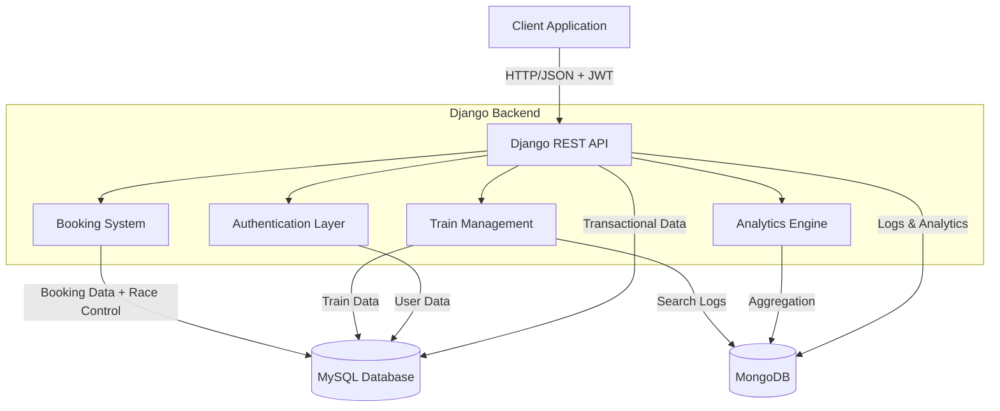

---

## 2. Database Schema (MySQL)

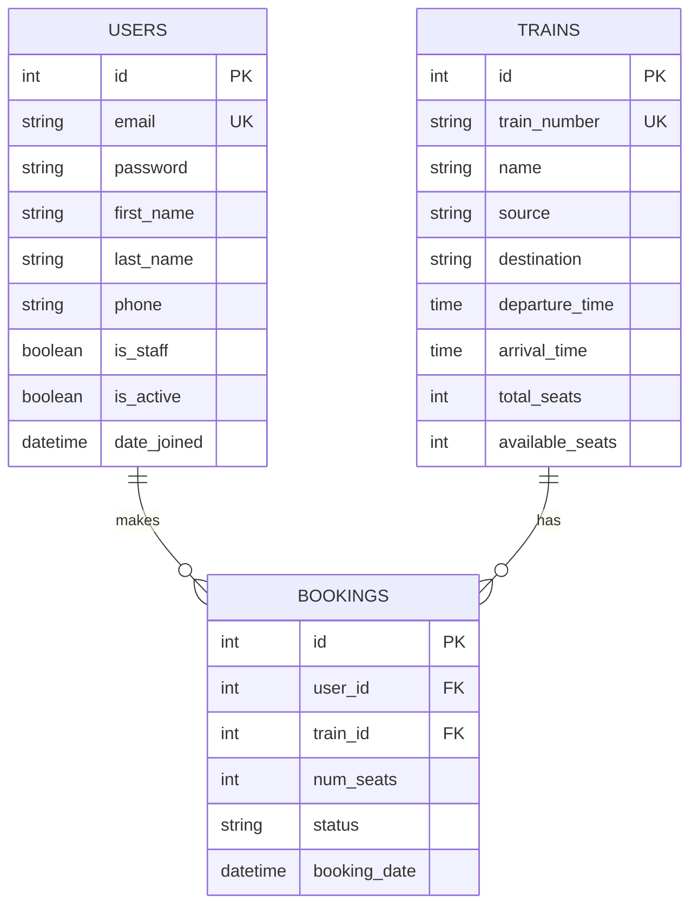

---

## 3. MongoDB Schema

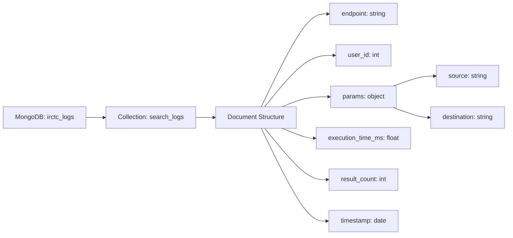

---

## 4. Authentication Flow

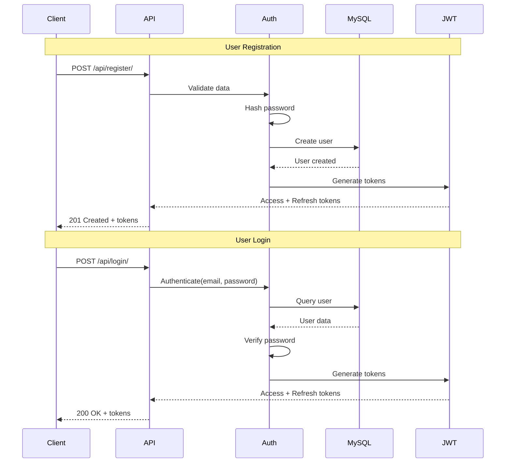

---

## 5. Train Search Flow with Logging

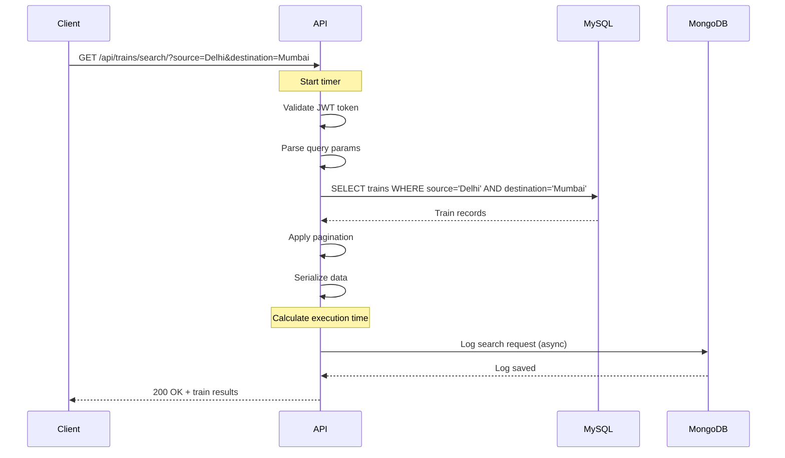

---

## 6. Booking Flow (Race Condition Prevention)

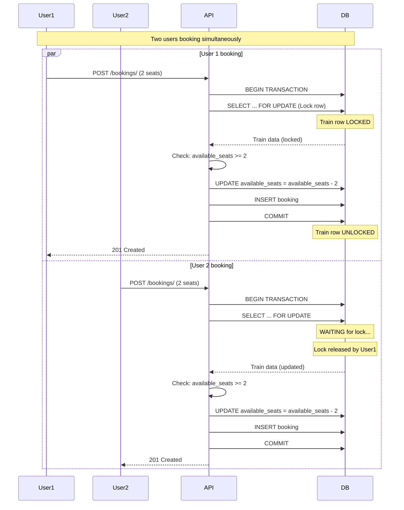

---

## 7. Complete API Request Flow

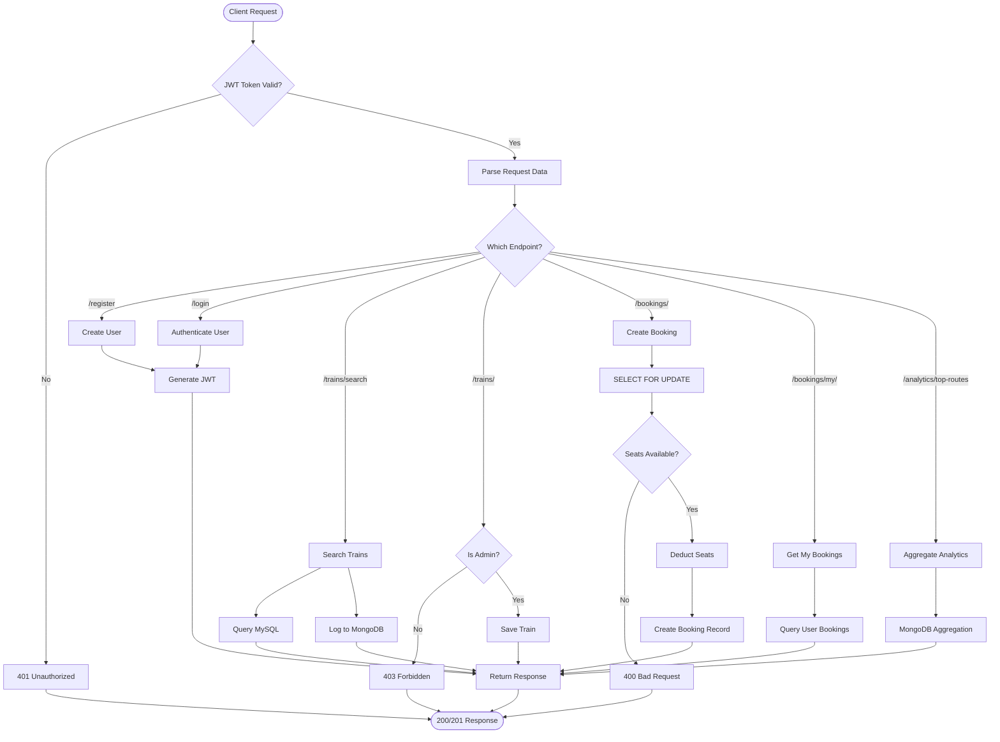

---

## 8. Admin vs User Access Control

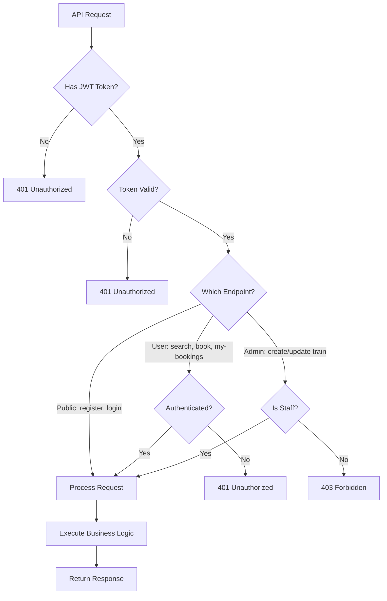

---

## 9. Booking State Machine

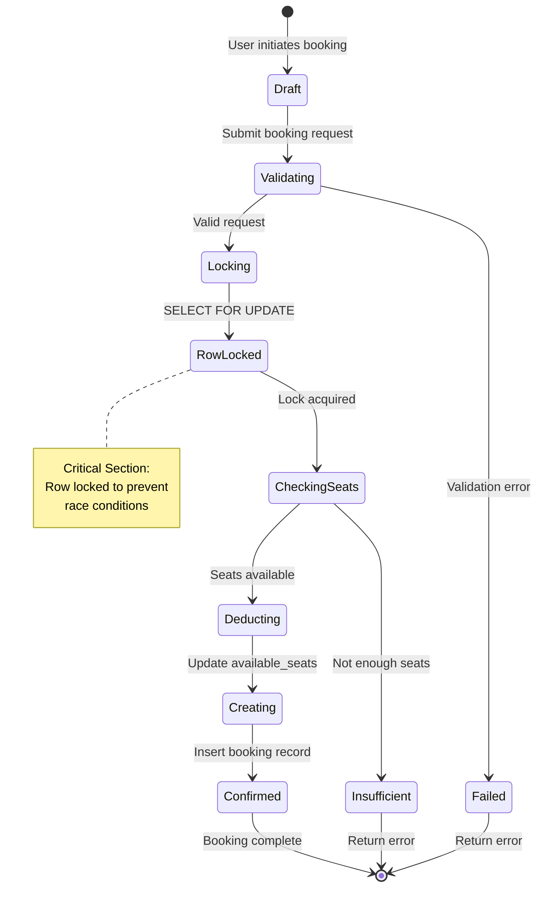

---

## 10. Analytics Pipeline

```mermaid
flowchart LR
    A[Train Search API] --> B[Log to MongoDB]
    B --> C[(MongoDB: search_logs)]
    
    C --> D[Analytics API Called]
    D --> E[Aggregation Pipeline]
    
    E --> F[Group by route]
    F --> G[Count searches]
    G --> H[Sort by count]
    H --> I[Limit to top 5]
    
    I --> J[Format response]
    J --> K[Return to client]
    
    style C fill:#47A248
    style E fill:#FF6B6B
```

---

## 11. Data Flow Architecture

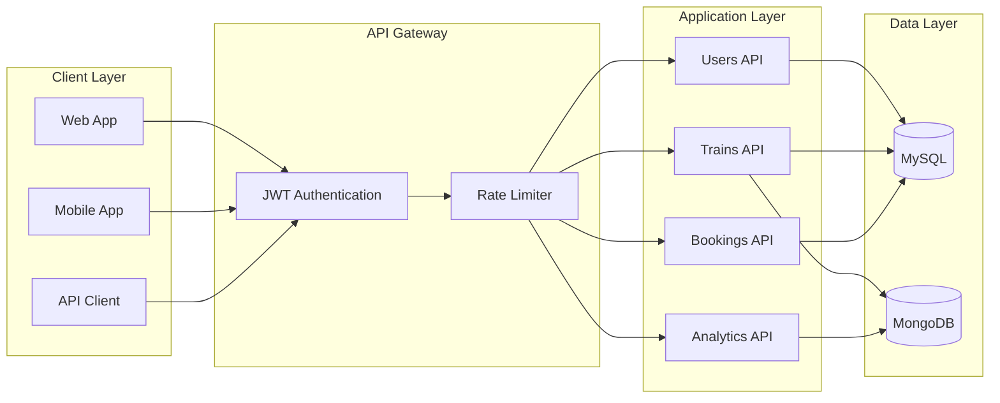

---

---

## 13. Error Handling Flow

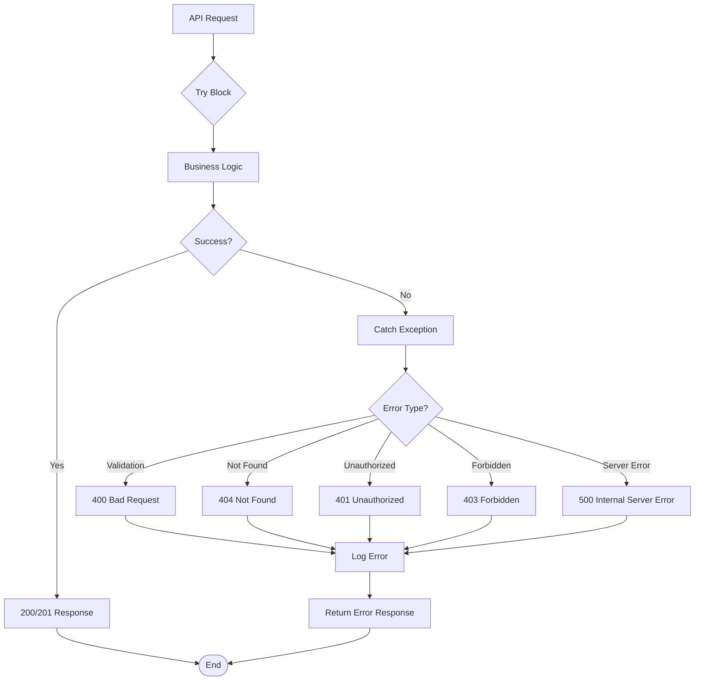

---