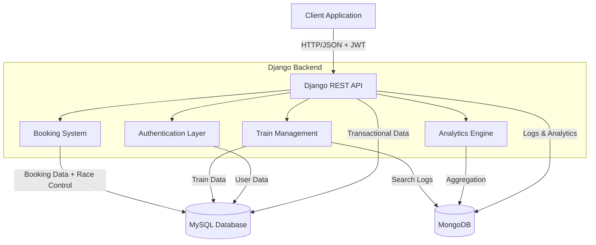

# IRCTC Backend System

A railway booking system built with Django REST Framework, featuring JWT authentication, race condition-safe booking, and MongoDB analytics.

## 1. System Architecture Overview



---
##  Tech Stack

- **Backend Framework**: Django 6.0.2 + Django REST Framework 3.16.1
- **Databases**: 
  - **MySQL**: Transactional data (users, trains, bookings)
  - **MongoDB**: API logs and analytics
- **Authentication**: JWT (djangorestframework-simplejwt)
- **Language**: Python 3.12

##  Project Structure

```
irctc_backend/
├── config/              # Django settings & main URLs
├── users/               # User authentication & management
├── trains/              # Train CRUD & search operations
├── bookings/            # Seat booking with concurrency control
├── analytics/           # MongoDB-based analytics
├── core/                # Shared utilities (MongoDB client)
├── manage.py
├── requirements.txt
└── README.md
```

##  Key Features

### Authentication
-  Email-based login (no username)
-  JWT access & refresh tokens
-  Role-based access control (Admin/User)

### Train Management
-  Admin-only train creation/updates
-  Search with filters (source, destination)
-  Pagination support (limit, offset)
-  Database indexing on source-destination

### Booking System
-  **Race condition prevention** using `select_for_update()`
-  Atomic seat deduction
-  Real-time seat availability checks
-  User booking history

### Analytics
-  MongoDB logging for all search queries
-  Execution time tracking
-  Top 5 most searched routes aggregation

## 🛠️ Setup Instructions

### Prerequisites

- Python 3.10+
- MySQL 8.0+
- MongoDB 6.0+

### Installation Steps

**1. Clone the repository**
```bash
git clone <your-repo-url>
cd irctc_backend
```

**2. Create virtual environment**
```bash
python3 -m venv venv
source venv/bin/activate  # On Windows: venv\Scripts\activate
```

**3. Install dependencies**
```bash
pip install -r requirements.txt
```

**4. Setup MySQL database**
```bash
# Login to MySQL
mysql -u root -p

# Create database and user
CREATE DATABASE irctc_db;
CREATE USER 'irctc_user'@'localhost' IDENTIFIED BY 'irctc_password';
GRANT ALL PRIVILEGES ON irctc_db.* TO 'irctc_user'@'localhost';
FLUSH PRIVILEGES;
EXIT;
```

**5. Setup MongoDB**
```bash
# Start MongoDB service
sudo systemctl start mongod
sudo systemctl enable mongod

# Verify it's running
mongosh
```

**6. Configure environment variables**
```bash
# Copy example env file
cp .env.example .env

# Edit .env with your credentials
nano .env
```

**Example .env:**
```env
DEBUG=True
SECRET_KEY=your-secret-key-here

# MySQL
DB_NAME=irctc_db
DB_USER=irctc_user
DB_PASSWORD=irctc_password
DB_HOST=localhost
DB_PORT=3306

# MongoDB
MONGO_URI=mongodb://localhost:27017/
MONGO_DB_NAME=irctc_logs
```

**7. Run migrations**
```bash
python manage.py makemigrations
python manage.py migrate
```

**8. Create superuser (admin)**
```bash
python manage.py createsuperuser
# Enter email and password
```

**9. Start development server**
```bash
python manage.py runserver
```

Server runs at `http://localhost:8000`

---

## 📡 API Documentation

### Base URL
```
http://localhost:8000/api
```

### Authentication

All endpoints except register and login require:
```
Authorization: Bearer <access_token>
```

---

### 1. User Registration

**Endpoint:** `POST /api/register/`

**Request:**
```bash
curl -X POST http://localhost:8000/api/register/ \
  -H "Content-Type: application/json" \
  -d '{
    "email": "user@example.com",
    "password": "SecurePass123!",
    "password2": "SecurePass123!",
    "first_name": "John",
    "last_name": "Doe",
    "phone": "9876543210"
  }'
```

**Response:** `201 Created`
```json
{
  "user": {
    "id": 1,
    "email": "user@example.com",
    "first_name": "John",
    "last_name": "Doe",
    "phone": "9876543210"
  },
  "tokens": {
    "refresh": "eyJhbGciOiJIUzI1NiIs...",
    "access": "eyJhbGciOiJIUzI1NiIs..."
  }
}
```

---

### 2. User Login

**Endpoint:** `POST /api/login/`

**Request:**
```bash
curl -X POST http://localhost:8000/api/login/ \
  -H "Content-Type: application/json" \
  -d '{
    "email": "user@example.com",
    "password": "SecurePass123!"
  }'
```

**Response:** `200 OK`
```json
{
  "user": {
    "id": 1,
    "email": "user@example.com",
    "first_name": "John",
    "last_name": "Doe",
    "phone": "9876543210"
  },
  "tokens": {
    "refresh": "eyJhbGciOiJIUzI1NiIs...",
    "access": "eyJhbGciOiJIUzI1NiIs..."
  }
}
```

---

### 3. Create Train (Admin Only)

**Endpoint:** `POST /api/trains/`

**Request:**
```bash
curl -X POST http://localhost:8000/api/trains/ \
  -H "Authorization: Bearer <admin_access_token>" \
  -H "Content-Type: application/json" \
  -d '{
    "train_number": "12951",
    "name": "Mumbai Rajdhani",
    "source": "Delhi",
    "destination": "Mumbai",
    "departure_time": "16:55:00",
    "arrival_time": "08:35:00",
    "total_seats": 200,
    "available_seats": 200
  }'
```

**Response:** `201 Created`
```json
{
  "id": 1,
  "train_number": "12951",
  "name": "Mumbai Rajdhani",
  "source": "Delhi",
  "destination": "Mumbai",
  "departure_time": "16:55:00",
  "arrival_time": "08:35:00",
  "total_seats": 200,
  "available_seats": 200
}
```

---

### 4. Search Trains

**Endpoint:** `GET /api/trains/search/`

**Query Parameters:**
- `source` (required): Source station
- `destination` (required): Destination station
- `limit` (optional, default=10): Results per page
- `offset` (optional, default=0): Pagination offset

**Request:**
```bash
curl -X GET "http://localhost:8000/api/trains/search/?source=Delhi&destination=Mumbai&limit=5&offset=0" \
  -H "Authorization: Bearer <access_token>"
```

**Response:** `200 OK`
```json
{
  "count": 1,
  "results": [
    {
      "id": 1,
      "train_number": "12951",
      "name": "Mumbai Rajdhani",
      "source": "Delhi",
      "destination": "Mumbai",
      "departure_time": "16:55:00",
      "arrival_time": "08:35:00",
      "total_seats": 200,
      "available_seats": 198
    }
  ]
}
```

**Note:** Each search is logged to MongoDB with execution time and user info.

---

### 5. Create Booking

**Endpoint:** `POST /api/bookings/`

**Request:**
```bash
curl -X POST http://localhost:8000/api/bookings/ \
  -H "Authorization: Bearer <access_token>" \
  -H "Content-Type: application/json" \
  -d '{
    "train": 1,
    "num_seats": 2
  }'
```

**Response:** `201 Created`
```json
{
  "id": 1,
  "train": {
    "id": 1,
    "train_number": "12951",
    "name": "Mumbai Rajdhani",
    "source": "Delhi",
    "destination": "Mumbai",
    "departure_time": "16:55:00",
    "arrival_time": "08:35:00",
    "total_seats": 200,
    "available_seats": 198
  },
  "num_seats": 2,
  "status": "confirmed",
  "booking_date": "2026-02-28T12:24:54.485680Z"
}
```

**Error Cases:**
- `400 Bad Request`: Insufficient seats
- `404 Not Found`: Train doesn't exist

---

### 6. My Bookings

**Endpoint:** `GET /api/bookings/my/`

**Request:**
```bash
curl -X GET http://localhost:8000/api/bookings/my/ \
  -H "Authorization: Bearer <access_token>"
```

**Response:** `200 OK`
```json
{
  "count": 1,
  "results": [
    {
      "id": 1,
      "train": {
        "id": 1,
        "train_number": "12951",
        "name": "Mumbai Rajdhani",
        "source": "Delhi",
        "destination": "Mumbai",
        "departure_time": "16:55:00",
        "arrival_time": "08:35:00",
        "total_seats": 200,
        "available_seats": 198
      },
      "num_seats": 2,
      "status": "confirmed",
      "booking_date": "2026-02-28T12:24:54.485680Z"
    }
  ]
}
```

---

### 7. Top Routes Analytics

**Endpoint:** `GET /api/analytics/top-routes/`

**Request:**
```bash
curl -X GET http://localhost:8000/api/analytics/top-routes/ \
  -H "Authorization: Bearer <access_token>"
```

**Response:** `200 OK`
```json
{
  "top_routes": [
    {
      "route": "Delhi - Mumbai",
      "search_count": 145
    },
    {
      "route": "Mumbai - Bangalore",
      "search_count": 98
    },
    {
      "route": "Delhi - Kolkata",
      "search_count": 76
    },
    {
      "route": "Chennai - Hyderabad",
      "search_count": 54
    },
    {
      "route": "Pune - Goa",
      "search_count": 42
    }
  ]
}
```

---

##  Security Features

### Race Condition Prevention
The booking system uses Django's `select_for_update()` within atomic transactions:

```python
with transaction.atomic():
    train = Train.objects.select_for_update().get(id=train_id)
    
    if train.available_seats < num_seats:
        raise InsufficientSeatsError
    
    train.available_seats -= num_seats
    train.save()
    
    Booking.objects.create(...)
```

This ensures:
- Row-level locking during booking
- No double-booking of seats
- ACID compliance for seat deduction

### Authentication
- Passwords hashed using Django's PBKDF2 algorithm
- JWT tokens with 5-hour expiry
- Email normalization (case-insensitive)

---

##  Testing

### Manual Testing with cURL

**Full Flow Test:**
```bash
# 1. Register user
TOKEN=$(curl -s -X POST http://localhost:8000/api/register/ \
  -H "Content-Type: application/json" \
  -d '{"email":"test@example.com","password":"Test123!","password2":"Test123!","first_name":"Test","last_name":"User"}' \
  | jq -r '.tokens.access')

# 2. Create train (as admin)
curl -X POST http://localhost:8000/api/trains/ \
  -H "Authorization: Bearer $ADMIN_TOKEN" \
  -H "Content-Type: application/json" \
  -d '{"train_number":"12345","name":"Express","source":"CityA","destination":"CityB","departure_time":"10:00:00","arrival_time":"18:00:00","total_seats":100,"available_seats":100}'

# 3. Search trains
curl -X GET "http://localhost:8000/api/trains/search/?source=CityA&destination=CityB" \
  -H "Authorization: Bearer $TOKEN"

# 4. Book seats
curl -X POST http://localhost:8000/api/bookings/ \
  -H "Authorization: Bearer $TOKEN" \
  -H "Content-Type: application/json" \
  -d '{"train":1,"num_seats":2}'

# 5. View bookings
curl -X GET http://localhost:8000/api/bookings/my/ \
  -H "Authorization: Bearer $TOKEN"

# 6. Check analytics
curl -X GET http://localhost:8000/api/analytics/top-routes/ \
  -H "Authorization: Bearer $TOKEN"
```

### MongoDB Logs Verification

```bash
mongosh
use irctc_logs
db.search_logs.find().pretty()
```

---

##  Database Schema

### MySQL Tables

**users**
```sql
- id (PK)
- email (unique)
- password (hashed)
- first_name
- last_name
- phone
- is_staff
- is_active
- date_joined
```

**trains**
```sql
- id (PK)
- train_number (unique)
- name
- source (indexed)
- destination (indexed)
- departure_time
- arrival_time
- total_seats
- available_seats
```

**bookings**
```sql
- id (PK)
- user_id (FK -> users)
- train_id (FK -> trains)
- num_seats (positive integer)
- status (confirmed/cancelled)
- booking_date
```

### MongoDB Collections

**search_logs**
```json
{
  "endpoint": "/api/trains/search/",
  "user_id": 2,
  "params": {
    "source": "Delhi",
    "destination": "Mumbai"
  },
  "execution_time_ms": 1.88,
  "result_count": 1,
  "timestamp": ISODate("2026-02-28T11:55:39.076Z")
}
```

---

##  Key Design Decisions

### 1. Why Email-based Authentication?
- More user-friendly than username
- Globally unique identifier
- Industry standard for modern apps

### 2. Why MySQL + MongoDB?
- **MySQL**: ACID compliance for critical transactions (bookings)
- **MongoDB**: Flexible schema for logs, better write performance

### 3. Why JWT over Sessions?
- Stateless authentication
- API-first architecture
- Easy horizontal scaling

### 4. Race Condition Strategy
- Database-level row locking (`select_for_update`)
- Atomic transactions
- More reliable than application-level locks

### 5. Why `PositiveIntegerField` for seats?
- Schema-level validation
- Prevents invalid data at database layer
- No negative/zero bookings possible

---

